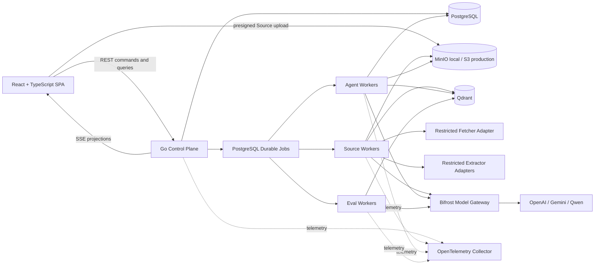

# Nano Notebook Technical Architecture

## 1. Purpose And Scope

Nano Notebook is a small, single-region SaaS research workspace implemented with a Go core. The first release targets roughly 100 registered users and about 10 concurrent Agent or Source-processing jobs. Its engineering depth is concentrated on durable Agent execution, evidence-grounded retrieval, authorization isolation, observability, and evaluation rather than hyperscale infrastructure.

The current milestone is a complete local product. Production launch is a later delivery stage with AWS as the intended direction, S3 as the production Blob Store, and static Web Client delivery through S3 and CloudFront. Exact AWS compute, networking, backup, OIDC, email, and secret-management services are not prerequisites for local completion.

The first release does not include an Agent Sandbox, arbitrary code execution, browser or computer use, general external tools, cloud-drive synchronization, Notes, search discovery, or generated Outputs. Search and the committed Output families remain later scope and will be scheduled after the initial dependency graph is complete.

## 2. System Shape



The Go application is a modular monolith with independently deployable Worker processes. Modules communicate through in-process interfaces and share PostgreSQL without sharing ownership of one another's tables. A Module becomes a network service only after operational evidence justifies extraction.

## 3. Authoritative Stores

| Store | Responsibility | Explicitly not responsible for |
| --- | --- | --- |
| PostgreSQL | Users, Sessions, Notebook membership, Source metadata, Chat, Agent Run, Job, Citation, version and publication state | Large Source bodies, vector similarity, operational telemetry |
| MinIO/S3 | Original Source blobs, normalized artifacts, large derived artifacts and selected Trace payloads | Authorization, workflow state, queryable business truth |
| Qdrant | Rebuildable dense and sparse retrieval projections | Authoritative text, permissions, Source or Citation lifecycle |
| Bifrost | Provider protocol translation and bounded call-level routing/fallback | Agent workflow state, provider selection policy ownership, durable product state |
| OpenTelemetry backend | Sampleable operational traces, metrics, and logs | Durable Agent Trace or product audit truth |

Every non-PostgreSQL record must be reachable from authoritative metadata and either rebuildable or removable through a Module-owned lifecycle.

## 4. Go Module Ownership

| Module | Owns | Depends on |
| --- | --- | --- |
| Identity | User identity, Local Credentials, opaque Sessions, later OIDC mapping | PostgreSQL |
| Notebook | Notebooks, ownership, Membership, invitations, role-derived Capabilities | Identity |
| Source | Source lifecycle, raw Blob references, Evidence Revisions, Evidence Units, overviews | Notebook, Jobs, Models |
| Chat | Private Chats, source-selection preference, User and published Assistant Messages | Identity, Notebook, Source |
| Agent | Agent Runs, fixed stages, accepted read-only actions, publication, Durable Agent Trace responsibility | Chat, Source, Retrieval, Jobs, Models |
| Retrieval | Retrieval Index Versions, chunk projections, scoped hybrid retrieval and result validation | Source, Notebook, Qdrant |
| Jobs | Durable Job admission, leases, attempts, retries, cancellation and Workload Classes | PostgreSQL |
| Models | Capability-level provider policy and Bifrost invocation | Bifrost |

Notebook membership never grants access to another Member's private Chat. Chat owns the private conversation; Source owns citable content; Agent and Retrieval hold references rather than alternate copies of authority.

## 5. Authentication And Authorization

Local development uses email and password Local Credentials and PostgreSQL-backed opaque application Sessions. Internal User identity is credential-neutral. Public launch is blocked on managed, provider-neutral OIDC and disabling Local Credential entry points.

Authorization uses two layers:

1. Go Capability policies map the authenticated Principal, Notebook role, resource ownership, and operation to a decision.
2. PostgreSQL row-level security prevents cross-Notebook and cross-creator reads even when application queries are defective.

Workers reauthorize before continuing durable work. Privileged maintenance and migration roles are separate from request and Worker roles. Clients never supply trusted Qdrant filters or authoritative ownership identifiers.

## 6. Source Ingestion And Evidence

### 6.1 Upload And Import

The Control Plane creates short-lived upload intents. Browser uploads go directly to MinIO/S3, and the Source Module finalizes only validated objects. Public URLs are fetched by a restricted Fetcher Adapter with HTTP(S)-only policy, public-destination validation for IPv4 and IPv6, redirect revalidation, size and decompression limits, timeouts, and no product database or durable credential access.

Complex document and media parsing runs behind least-privileged Extractor Adapters. The authoritative Source Worker owns Job state, validates the output, and publishes artifacts; Extractors cannot publish product state or access PostgreSQL and Qdrant.

### 6.2 Durable Pipeline

Each Source advances through a fixed durable pipeline:

```text
uploaded -> validating -> normalizing -> segmenting -> indexing -> verifying -> ready
                                                                  \-> failed
```

Stages checkpoint completed work and artifact references. OCR, transcription, parsing, and embedding are not repeated merely because a later stage failed. Adapter-internal bounded parallelism does not become a generic DAG.

### 6.3 Evidence Identity And Index Versions

An immutable Source may have multiple Evidence Revisions when extraction, OCR, or transcription changes. Each revision contains stable Evidence Units with source-native Citation coordinates. Retrieval Chunks are overlapping, rebuildable windows over Evidence Units and never become Citation identities.

Chunking or embedding changes create a Retrieval Index Version without changing the Evidence Revision. Workers fully build and verify new artifacts and Qdrant points before PostgreSQL publishes an active version. Agent Runs pin their Evidence Revisions and Retrieval Index Version so processing changes cannot alter evidence mid-run.

## 7. Retrieval Architecture

All active Sources in one embedding space share Qdrant Collections. Indexed Payload fields include Notebook, Source, Evidence Revision, and index-version identity. The Retrieval Module constructs every filter from the authorized Notebook and the fixed Run Evidence Set; selected Sources use a server-built match-any condition. PostgreSQL revalidates returned Evidence Unit identities before authoritative content is loaded.

The first-release retrieval pipeline is:

```text
typed Agent query
-> dense retrieval under Retrieval Scope
-> sparse retrieval under the same Retrieval Scope
-> RRF rank fusion
-> authoritative evidence load
-> bounded reranking
-> Evidence candidates returned to Agent Controller
```

Dense-only retrieval is an intermediate implementation milestone, not the completed product path. Embedding, sparse and reranker models, chunking, candidate limits, weights, and stopping thresholds are selected through offline evaluation rather than fixed by overall architecture.

Gemini converts visual and structured inputs into region-linked normalized textual evidence. Documents, HTML, transcripts, OCR, and visual descriptions enter one text Retrieval Channel in the first release. Original media and Citation coordinates remain available, but native visual-vector retrieval and cross-channel fusion are deferred.

## 8. Durable Agent Runtime

The bounded PostgreSQL Durable Runtime supports fixed product Job types, not arbitrary workflows. The Agent Controller advances a Run through fixed outer stages such as planning, research, retrieval, inspection, comparison, refinement, verification, composition, and terminal states. The model may propose only typed, read-only research actions; Go validates scope, budgets, stage preconditions, and permissions.

Sprint 2A establishes the first production-shaped slice with one fixed pass: `LoadRun -> BuildContext -> InvokeModel -> PublishAnswer`. A request transaction commits the User Message, product-facing Agent Run, and internal Agent Job atomically. The independent Worker claims the Job from PostgreSQL, builds one in-memory request from the system prompt and latest 20 durable Messages, calls Bifrost without provider token streaming, and publishes the complete Assistant Message through one transaction. This is intentionally a fixed Agent Loop with no tool-call iteration, Retrieval, MCP, checkpoint, or generic workflow abstraction.

Sprint 2A Jobs have only `queued`, `running`, and terminal delivery state. PostgreSQL `LISTEN/NOTIFY` reduces wake-up latency and a five-second indexed scan recovers lost notifications; the Job row is always queue truth. Attempts, leases, heartbeats, fencing, process-loss recovery, and safe re-execution are Sprint 2C work and must be added before claiming at-least-once recovery semantics.

The completed durable runtime will use at-least-once leases, attempts, heartbeats, and idempotent effect boundaries. Fixed interactive Agent, Source Processing, and offline Eval/Reindex Workload Classes reserve capacity so background work cannot starve user-facing Runs.

Checkpoint representation, Run Working State schema, exact recovery algorithm, lease values, retry values, and context-manifest format are deferred to the Runtime detailed-design grill. Overall architecture requires only that a Run survive process loss and that the Context Builder can construct the next bounded model input from persistent Chat, accepted actions, Evidence, and versioned configuration.

No generic workflow SDK, arbitrary DAG, deterministic replay, exactly-once promise, multi-Agent runtime, or Agent Sandbox enters the first release. An external MQ is metrics-triggered evolution rather than scheduled scope. If PostgreSQL dispatch becomes a measured bottleneck in the intended AWS environment, SQS plus a transactional outbox is the preferred direction while PostgreSQL retains authoritative Job and Run state.

## 9. Cancellation And Publication

Stop, Source deletion, Membership removal, and Notebook deletion first persist cancellation or invalidation. Workers observe it at bounded transitions, reauthorize, and request cancellation of in-flight dependencies where supported. Expired Worker attempts cannot commit through lease fencing and state-version checks.

Streaming text is provisional. A draft becomes a durable Assistant Message and Citations only through one transactional Publication Barrier that revalidates:

- the current Principal and private Chat ownership;
- Notebook membership and role;
- every Source and Evidence Revision in the Run Evidence Set;
- Citation resolution and grounded-answer validation;
- absence of cancellation or invalidation.

The Sprint 2A model-knowledge path has no Citations or Run Evidence Set. Its publication transaction still revalidates private Chat creator ownership and current Notebook membership, then inserts exactly one Assistant Message marked `model_knowledge` while completing the Run and Job. Failed Runs publish no Assistant Message. Source availability and Citation validation join the same barrier when grounded answering is implemented.

Stopped, failed, or invalidated work retains the User Message and Run status but never presents an incomplete response as a completed Grounded Answer.

## 10. Chat And Browser Interfaces

The Web Client is a React and TypeScript SPA built with Vite. It consumes JSON REST commands and queries from the Go Control Plane and uses SSE for asynchronous projections. The client first reads the latest durable snapshot; SSE is never authoritative state.

The selected browser UI baseline is React 19, TypeScript, Vite, Tailwind CSS 4, shadcn/ui New York-style primitives on Radix UI, TanStack Query, TanStack Table, React Hook Form, Zod, Sonner, and locally hosted Material Symbols. Sprint 2A mounts `@assistant-ui/react` through its external-store boundary: PostgreSQL-backed Messages and Run state remain server-owned, while Assistant UI supplies accessible thread and composer interaction. The browser assigns the User Message UUID, submits one command, and projects queued/running/terminal state from a per-Run EventSource.

Sprint 2A SSE sends complete current Run snapshots rather than provider token deltas. The Control Plane owns one shared PostgreSQL Run listener and fans wake-ups to in-process per-Run subscribers; each subscriber reloads authorized PostgreSQL state. Reconnect reads the latest snapshot, so this slice needs no durable event log, cursor, or `Last-Event-ID`. Those stronger replay contracts are added only when a later feature actually requires them.

Each Chat belongs to one creator and remains private even from the Notebook Owner. In Sprint 2A, a submitted User Message creates a source-less model-knowledge Run. Later grounded Runs additionally pin a fixed Run Evidence Set, and Source-selection changes apply only to later Runs. Only the Publication Barrier can add the corresponding Assistant Message. Failed or stopped Runs can be retried as new Runs without editing history.

## 11. Model Gateway And Provider Portfolio

Bifrost runs as a standalone local container with file configuration and environment-provided secrets. Nano Notebook owns routing intent and durable state; Bifrost performs protocol translation and bounded call-level retry or fallback. Retry budgets must not multiply across the Agent Runtime and gateway.

The initial capability portfolio is:

| Capability | Providers and boundary |
| --- | --- |
| Text generation | OpenAI, Gemini, and Qwen |
| Vision normalization | Gemini default, OpenAI second implementation |
| Embedding | Multiple adapters; one model per Retrieval Index Version; model change requires reindex |
| Reranking | Qwen `qwen3-rerank` participates in evaluation |
| Transcription | One accepted OpenAI implementation initially because timestamp quality is part of Citation correctness |

Bifrost UI, persistent configuration database, semantic cache, and Agent features are excluded. The default embedding model remains an evaluation result.

## 12. Observability And Evaluation

Operational Telemetry uses OpenTelemetry-compatible context across the Control Plane, Jobs, Workers, Bifrost, PostgreSQL, Qdrant, and Blob Store. It may be sampled and expired. The Agent Module separately owns the mandatory Durable Agent Trace; both are correlated by trace, Run, Job, and attempt identifiers. The Trace completeness contract, schema, payload storage, sensitive-data policy, access, and retention are deferred to detailed design.

The first release includes an offline Eval Harness that invokes production Source, Retrieval, Models, and Agent interfaces. Versioned Eval Cases identify allowed and expected evidence or answer rubrics. Eval Runs record the full retrieval, model, prompt, and Agent configuration and measure retrieval quality, Citation correctness and coverage, groundedness, latency, tokens, and cost. Eval execution may use CLI and Workers; a management UI, online A/B system, and automatic tuning platform are excluded.

## 13. Deletion And Retention

Destructive commands synchronously remove product visibility and future use in PostgreSQL, cancel affected Runs, and create idempotent Module-owned purge work. A minimal non-content Deletion Tombstone may coordinate cleanup but is not a restorable soft-delete feature.

Purge Jobs remove Qdrant projections, Blob Store objects, derived artifacts, private Chat content, and relevant Trace payloads according to ownership and references. Cleanup failure cannot make content visible again. Existing messages keep their Citation marker after Source deletion, but resolution reports the Source unavailable and reveals no deleted passage.

Production launch must define backup expiry and each Provider's retention and deletion guarantees. The product's immediate access revocation does not wait for backup or Provider cleanup.

## 14. Verification Strategy

Verification is layered around real ownership boundaries:

- unit tests cover Capability policy, fixed state transitions, Context Builder selection, filter construction, Citation validation, and pure adapters;
- integration tests use real PostgreSQL with RLS, MinIO, Qdrant, and Bifrost with controlled upstreams;
- provider contract suites use sanitized fixtures plus opt-in live smoke tests;
- a real-S3 compatibility suite is a production-launch gate;
- local end-to-end tests exercise the four product acceptance journeys in a browser;
- fault injection covers Worker termination, expired leases, duplicate attempts, Provider timeout, Qdrant unavailability, Source deletion, Membership removal, and Publication Barrier races;
- authorization tests attempt cross-Notebook, cross-role, and cross-creator access at both Go policy and RLS layers;
- Fetcher tests cover private and reserved address ranges, DNS rebinding defenses, redirects, decompression limits, and unsupported protocols.

Mock-only green tests are insufficient for local product completion.

## 15. Local Development And Production Gates

Docker Compose runs PostgreSQL, MinIO, Qdrant, Bifrost, and local observability dependencies. Go Control Plane, Go Workers, and React/Vite run natively by default for fast debugging; Extractors remain containerized for isolation. Repository-owned commands provide bootstrap, migration, seed, start, test, and cleanup flows. CI may use a profile that also containerizes application processes. Kubernetes is not part of local development.

Before production launch, the architecture requires at least:

- managed OIDC enabled and Local Credential entry points disabled;
- AWS S3 compatibility verified and backup/deletion policy defined;
- production secret management, email delivery, network egress, and Extractor isolation accepted;
- Provider retention and privacy behavior documented;
- operational telemetry backend and alerts configured;
- production compute topology selected from measured local and pre-production behavior.

## 16. Deferred Detailed Design

The following are intentionally unresolved until the owning subsystem is implemented:

- Run Working State, Checkpoint, Ledger, Context Builder, cancellation polling, and full Trace schemas;
- chunking, embeddings, sparse representation, retrieval limits, fusion weights, reranking, and evaluation thresholds;
- exact parser libraries, OCR prompts, transcription timestamp normalization, and Citation coordinate schemas;
- Go HTTP framework, SQL access layer, migrations, repository package layout, and frontend component choices beyond the selected browser UI baseline;
- session expiry values, invitation email implementation, retry counts, timeouts, concurrency values, and retention durations;
- production AWS compute, OIDC provider, email provider, secret store, observability backend, and optional future MQ.

These decisions must preserve the authority, isolation, and data-flow boundaries in this document.
